# T06: Accés remot — Windows ↔ Zorin (RDP/Remmina)

Guia breu per habilitar i provar l'accés remot entre un equip Windows i un equip Zorin OS.

---

## 1) Configuració a Windows (servidor RDP)

1. Configurem l'adaptador de xarxa en mode “només l'amfitrió”.

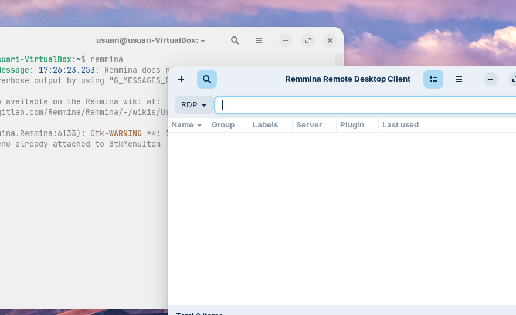

---

2. Obrim la configuració d'“Escritorio remoto”.

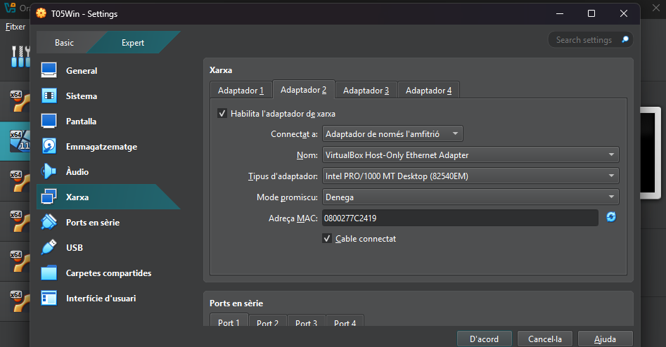

---

3. Activem l'escriptori remot.

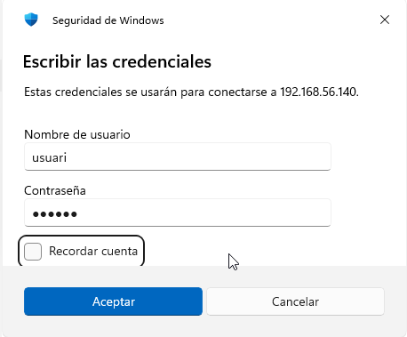

---

## 2) Configuració a Zorin (servidor VNC/RDP)

1. A Zorin, anem a Settings → System → Remote Desktop.

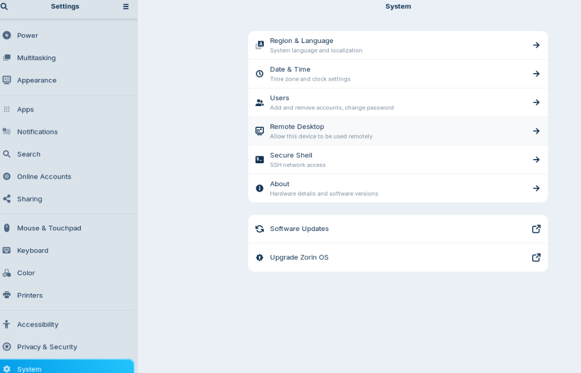

---

2. Activem “Desktop sharing” i “Remote control”; definim usuari i contrasenya de l'usuari actiu.

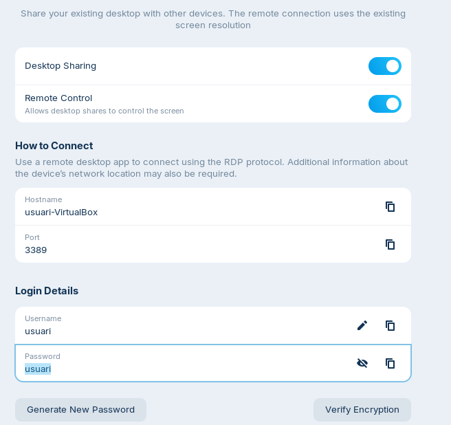

---

## 3) Connexió des de Windows cap a Zorin

1. Obrim l'aplicació “Conexión a Escritorio Remoto” a Windows i introduïm la IP de Zorin (obtinguda amb `ip a`).

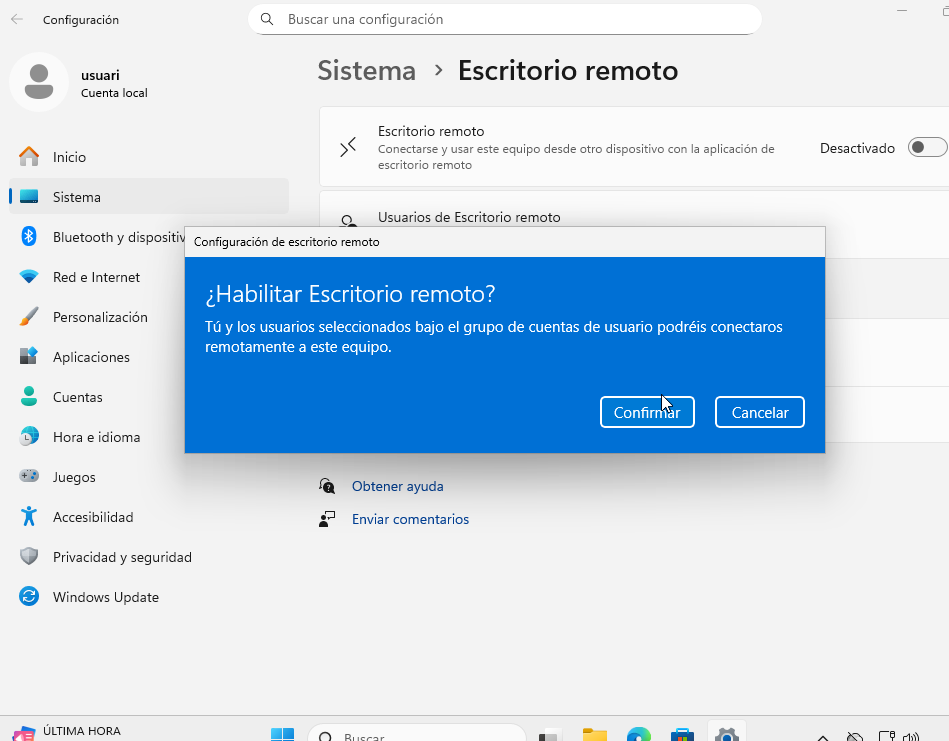

---

2. Introduïm usuari i contrasenya quan es demani.

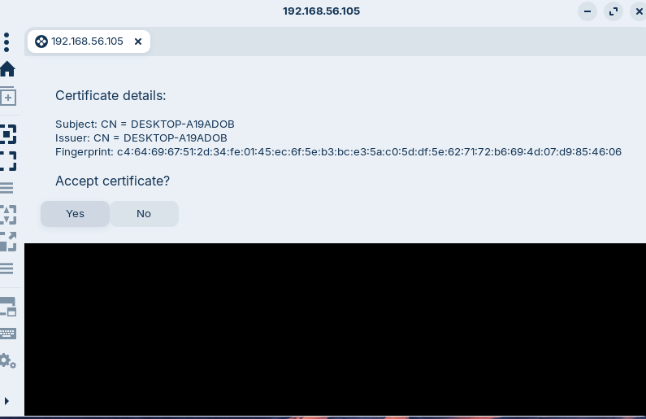

---

3. Acceptem l'avís del certificat.

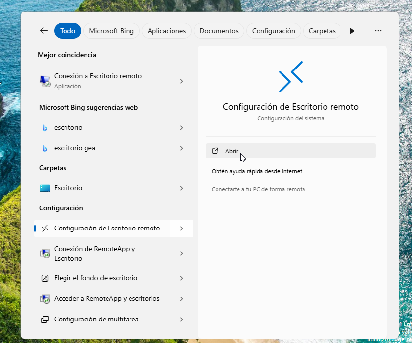

---

4. Sessió remota establerta.

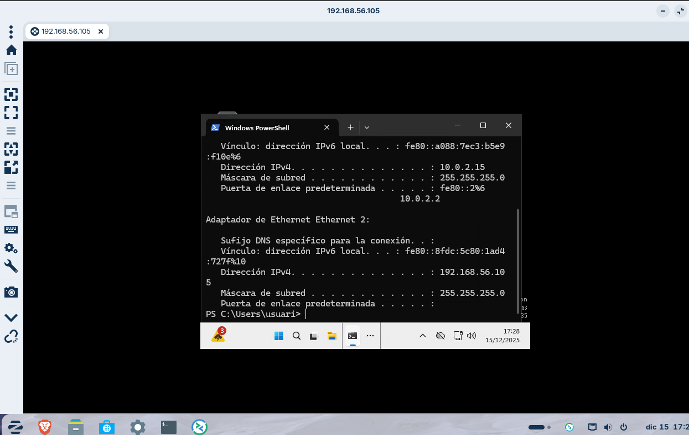

---

## 4) Connexió des de Zorin cap a Windows (Remmina)

1. A Zorin, obrim Remmina (client de connexions remotes per defecte) i creem una connexió.

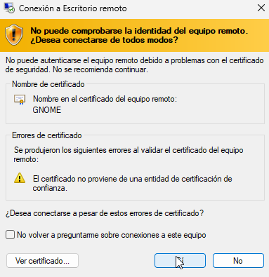

---

2. Acceptem també l'avís de certificat.

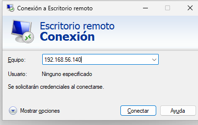

---

3. Introduïm usuari i contrasenya i accedim.

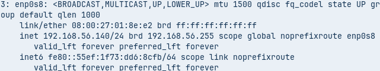

---

Fi.
