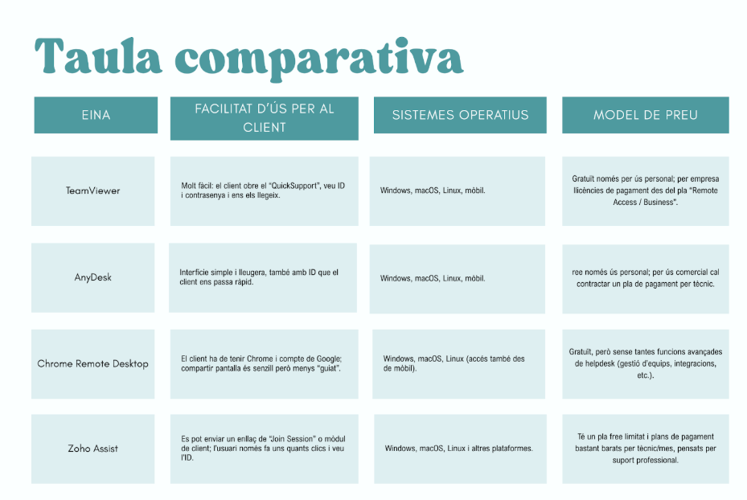
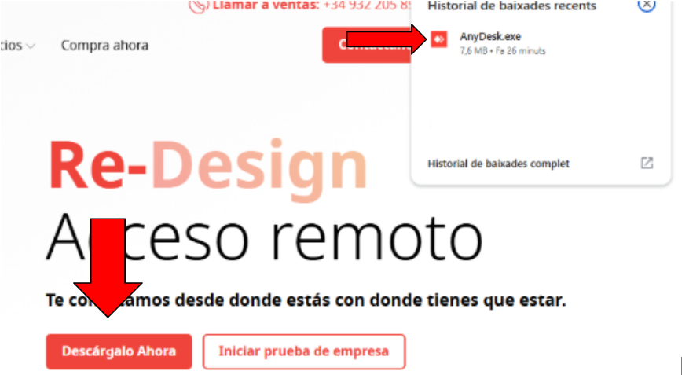
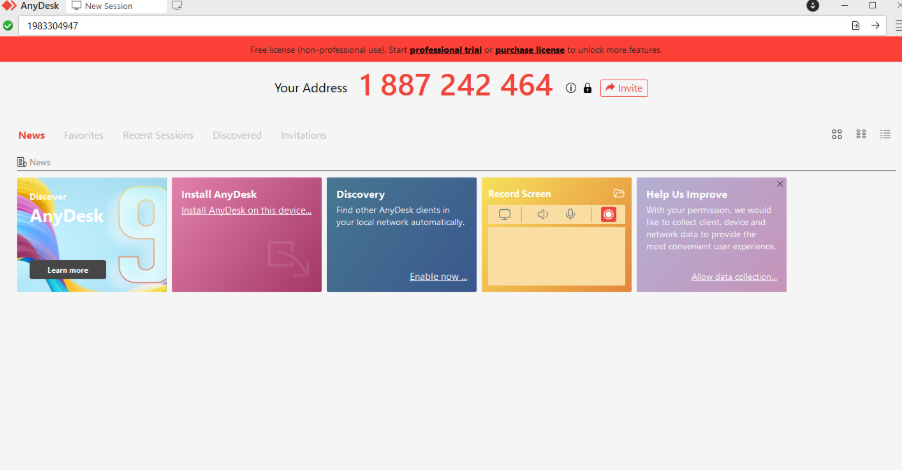
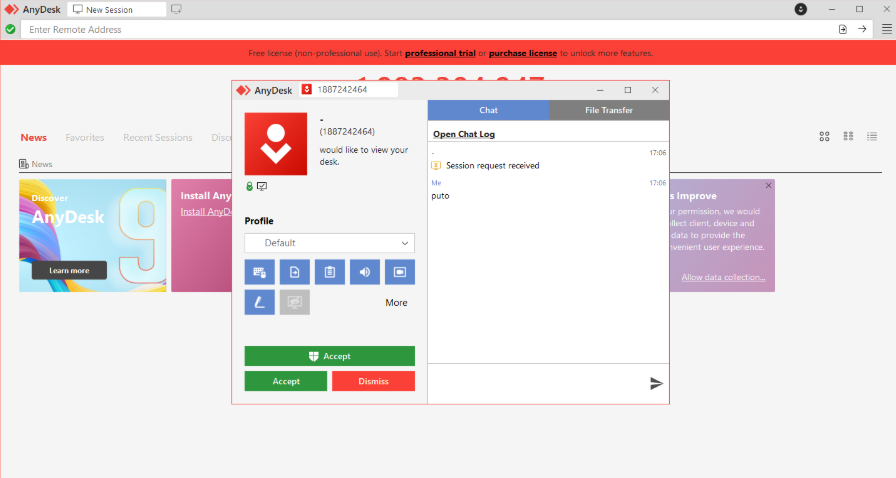
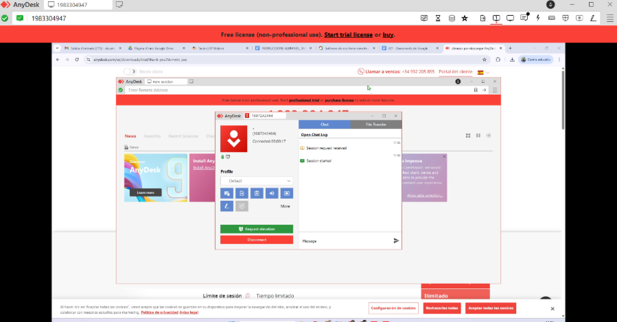

# 1. Eines d’assistència remota analitzades

En parella hem analitzat 4 eines d’assistència remota sota demanda:

- **TeamViewer**: molt coneguda, amb mòdul “QuickSupport”, però la versió gratuïta és només per a ús personal, i per ús comercial cal llicència de pagament bastant cara.

- **AnyDesk**: alternativa lleugera i ràpida, també amb versió “portable”, però igual: free només per ús personal i llicències de pagament per a empreses.

- **Chrome Remote Desktop (Google)**: funciona des del navegador Chrome, és gratuït i multi-plataforma (Windows, macOS, Linux), però és més bàsic i menys pensat com a producte “helpdesk professional”.

- **Zoho Assist**: eina cloud de suport remot pensada directament per empreses i helpdesk, amb mòduls de remote support i unattended access, suport per Windows, macOS i Linux, i funcions com compartir pantalla, transferència d’arxius, xat, multi-monitor, etc.

En parella hem tret la conclusio de que anydesk, en base preu i facilitat de fer servir aniria millor, de part de client es molt facil de fer servir, y de part del tecnic no es molt elevada de preu

---

Per començar hem d'instal·lar **AnyDesk**, i per això:

1. Ens dirigirem a la pagina  d'AnyDesk
2. Fem clic a **Descargar ahora**, i ens sortirà a descàrregues `AnyDesk.exe`, el qual executarem.

Aquest serà el menú principal, on posa **Your Address**. Hauràs de preguntar al client la seva adreça i després, on hem posat `1983304947`, és on es posa l’adreça del client.

Aquest és el menú que sortirà al nostre client, on es veu que hem sol·licitat, i podrem donar a **Acceptar**.

I això és el que veurem nosaltres. Hi ha diversos botons que pot fer servir el client, com:

- **Elevar permisos**
- On posa **Default** podem donar accés total
- Podem treure el so
- Podem escriure en un **chat** per tenir comunicació

